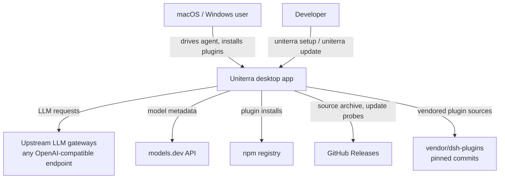

# Architecture

Uniterra is a thin desktop shell over the bundled DeepSeek Harness (dsh) agent runtime. The Electron main process boots the dsh CLI as a child, provisions built-in plugins + skills into the user's dsh profile, and hosts dsh's Web UI in a BrowserWindow. No app-owned state: everything the agent uses lives in the user's normal dsh home.

## System Context (C4 Level 1)



| Node                  | Type              | Notes                                                        |
| --------------------- | ----------------- | ------------------------------------------------------------ |
| macOS / Windows user  | person            | Runs the app; uses dsh's Web UI + plugins                    |
| Developer             | person            | Installs/updates via the `uniterra` CLI                      |
| Uniterra              | system            | Electron shell + bundled dsh runtime + built-ins             |
| Upstream LLM gateways | external          | Chat Completions and/or Responses API                        |
| models.dev API        | external          | Context/output/reasoning metadata per model                  |
| npm registry          | external          | CLI distribution, `dsh plugin add`, dshmarket                |
| GitHub Releases       | external          | Source archive for `uniterra setup`; `releases/latest` probe |
| vendor/dsh-plugins    | external (pinned) | Community plugins vendored at fixed commits                  |

## Containers (C4 Level 2)

```mermaid
graph TD
    subgraph Uniterra
        Main[Electron main process<br/>main.ts]
        Dsh[dsh CLI child process<br/>bundled runtime]
        UI[BrowserWindow<br/>dsh Web UI loopback]
        Profile[~/.dsh profiles/web<br/>bundles + node_modules + skills]
        Adapter[uniterra-provider plugin<br/>llm-uniterra adapter]
    end
    Main -->|spawn node dsh/bin.js --profile web| Dsh
    Main -->|ensureBuiltinPlugins + DSH_BUNDLED_SKILL_DIR| Profile
    Main -->|loads readiness URL| UI
    Dsh -->|serves SPA on 127.0.0.1:port| UI
    Dsh -->|llm route| Adapter
    Adapter -->|POST /chat/completions or /responses (SSE)| Gateway[Upstream LLM gateways]
    Adapter -->|api.json download| ModelsDev[models.dev API]
```

| Container         | Technology                       | Responsibility                                                        |
| ----------------- | -------------------------------- | --------------------------------------------------------------------- |
| Electron main     | Electron 37, Node 22             | Boot, supervision, built-in provisioning, update check, crash restart |
| dsh CLI child     | @deepseek-ai/dsh 0.1.1-rc.2      | Agent runtime: agent loop, skills, plugin loader, web server          |
| BrowserWindow     | Chromium, sandboxed              | dsh Web UI on a loopback origin                                       |
| Profile           | ~/.dsh/profiles/web              | User's dsh config + plugin bundles + provisioned skills               |
| uniterra-provider | in-house plugin (esbuild bundle) | LLM adapter: dual-protocol serialize/translate, models.dev lookup     |

## Data Flow

### Boot

1. Single-instance lock → resolve dev/packaged paths (`bundledSrcRoot`, `dshCliPath`).
2. Dev: mirror `~/.dsh` → `userData/dsh-test-home` (config only). Packaged: real `~/.dsh`.
3. `ensureBuiltinPlugins` — no-op if fresh; else `dsh plugin add` npm built-ins + copy vendored/workspace built-ins + bundle rows.
4. `startDsh({ profile: 'web', dshBundledSkillDir })` → spawn → `awaitReadiness` (60 s) → URL.
5. `createWindow(url)`; schedule update check (5 s delay); wire crash backoff.
6. Boot failure → append to `userData/startup-error.log` + (first boot) `dialog.showErrorBox` → quit.

### One agent turn

1. User prompt → dsh Web UI (loopback) → dsh runtime agent loop.
2. LLM call → uniterra-provider adapter → protocol resolved per model (`chat-completions` | `responses`).
3. Serialize harness messages → wire body → POST to the configured gateway → parse SSE → translate to harness chunks (no loss / no duplication of reasoning; thinking-mode reasoning passed back on every tool-call continuation).
4. Agent loop continues with tools/skills; skills resolved from `DSH_BUNDLED_SKILL_DIR` (bundled, rank 600) and the user's own skills dir.

### Install / update

- `uniterra setup`: GitHub source archive (or `--source` checkout) → pnpm install → build → electron-builder `--mac` / `--win --dir` → embed source (`Contents/Resources/src` / `resources/src`) → install (`~/Applications/Uniterra.app` / `%LOCALAPPDATA%\Programs\Uniterra` + Start Menu shortcut). On Windows, after the install the CLI re-points pnpm junctions whose absolute targets still reference the staging tree, so the installed source is self-contained.
- Update check probes GitHub release + npm dist-tag; Update Now quits the app and runs `uniterra update` detached — `uniterra update` refreshes the CLI, rebuilds + reinstalls the app, and relaunches it when done; Skip persists to `userData/uniterra-update-state.json`.

## Key Decisions

| Decision                                                                                            | Rationale                                                                                                      | Status |
| --------------------------------------------------------------------------------------------------- | -------------------------------------------------------------------------------------------------------------- | ------ |
| Thin shell: Electron hosts the bundled dsh CLI instead of reimplementing                            | Uniterra IS the dsh desktop surface; user's normal dsh config, no app-owned home                               | Active |
| Source is the artifact: build the app on the user's machine, no CI-built binaries                   | Reproducible from the release archive; future cross-platform packaging                                         | Active |
| Whole source tree embedded under the app resources dir (`Contents/Resources/src` / `resources/src`) | Packaged app resolves CLI/skills/vendors from the embedded source; `process.resourcesPath` is platform-neutral | Active |
| Dual-protocol provider plugin with per-model `api` override                                         | Gateways mix protocols per model; one adapter covers both wire shapes                                          | Active |
| Built-ins ensured idempotently into the user's profile                                              | User-installed plugins and edits are never touched; missing/stale built-ins heal on next launch                | Active |
| Vendored plugins pinned at commits (copied, not pnpm-installed)                                     | No version-lock surprise; peers not on npm                                                                     | Active |
| Content-identity staleness (version compare), not bundle-list                                       | A fixed distribution can ship under the same package name                                                      | Active |
| Skills ship as bundled provider (`DSH_BUNDLED_SKILL_DIR`) + pi-agent provisioning                   | Company workflow skills available to every session; user edits survive                                         | Active |
| Dev mirrors `~/.dsh` to a test home                                                                 | Dev never touches the real user config                                                                         | Active |
| PBT-first: business logic pinned as properties before fix/dev                                       | Bugs become machine-search problems; regressions locked                                                        | Active |

## Deployment Topology

| Environment            | Shape                                                                                                                                                                                          |
| ---------------------- | ---------------------------------------------------------------------------------------------------------------------------------------------------------------------------------------------- |
| User machine (macOS)   | `~/Applications/Uniterra.app` — Electron + embedded source + `~/.dsh` profile with built-ins                                                                                                   |
| User machine (Windows) | `%LOCALAPPDATA%\Programs\Uniterra\Uniterra.exe` — `win-unpacked` + embedded source + Start Menu shortcut + `~/.dsh` profile                                                                    |
| npm                    | `@uniterra-solutions/uniterra` CLI (trusted publishing, OIDC provenance)                                                                                                                       |
| GitHub                 | Release per `v*` tag; auto-generated source archive is the desktop artifact                                                                                                                    |
| Verification           | `scripts/verify-cli-container` replays the setup flow in a clean Docker container; `scripts/verify-windows-install` replays the real Windows install on windows-latest — both gate the release |

## How to Update

- Structural change (new process, new external dependency, new decision) → update the matching diagram/table in the same commit as the code.
- Boot or data-flow change → update the Data Flow section.

## Find It Fast

```bash
grep -n 'async function boot' packages/uniterra-desktop/src/main.ts  # boot order
grep -n 'ensureBuiltinPlugins' packages/uniterra-desktop/src/builtin.ts
```
